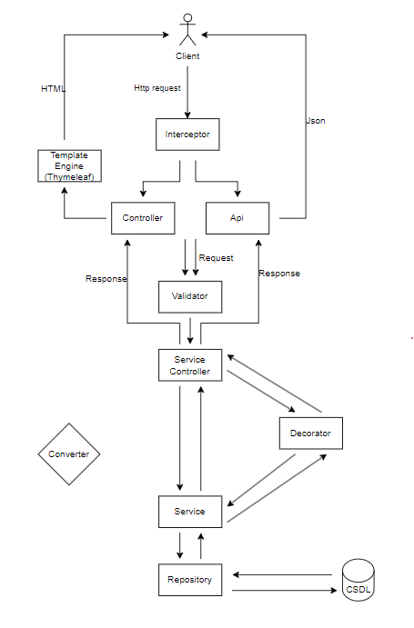
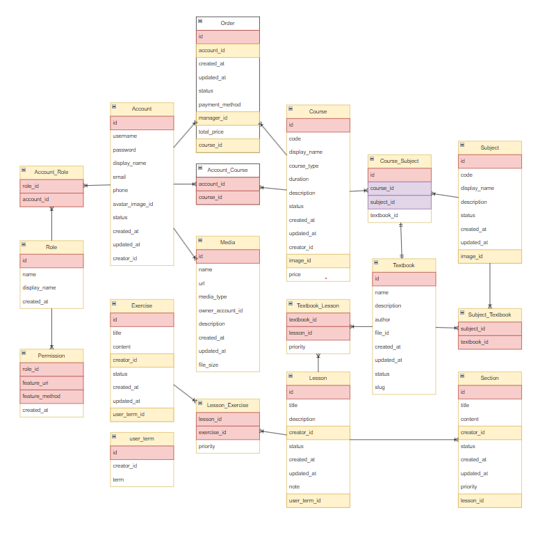
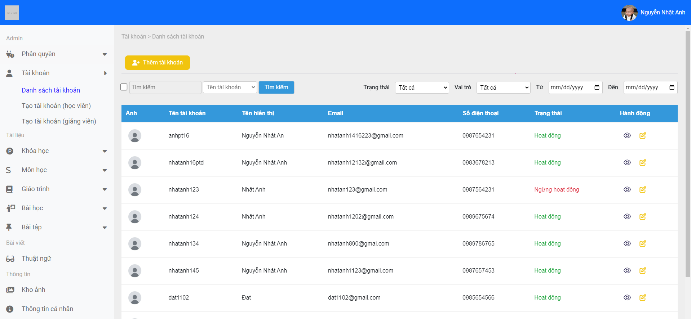
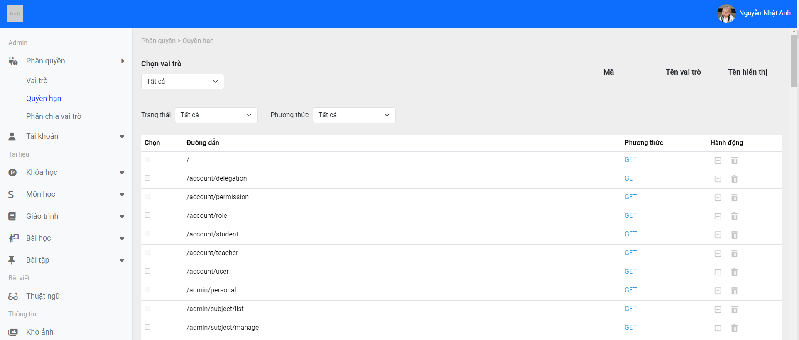
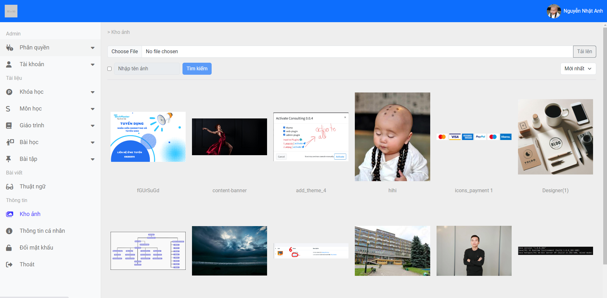
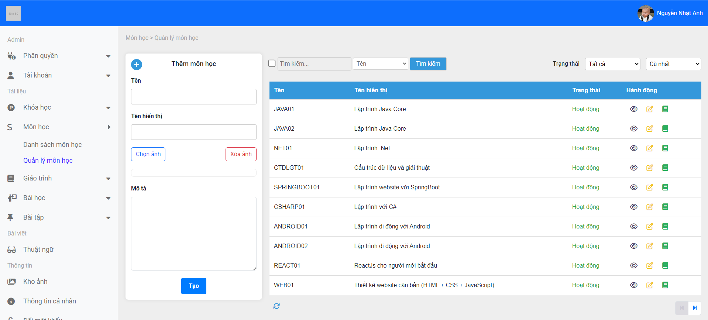
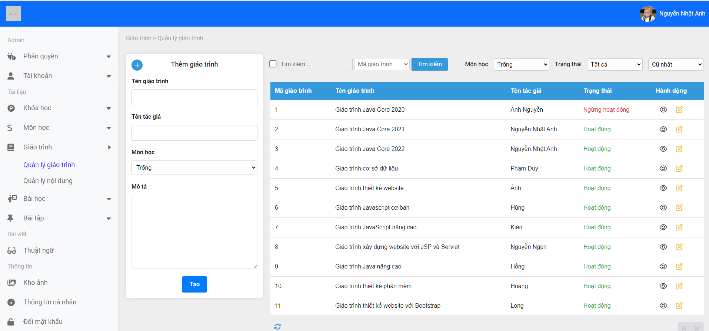
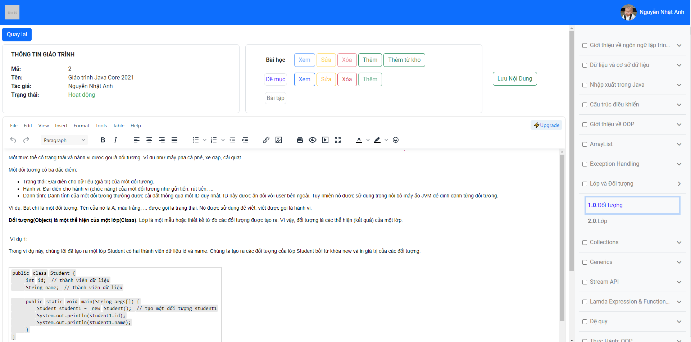

## Xây dựng website bán khóa học
**1. Mục tiêu đề tài**
- Nâng cao kinh nghiệm trong việc viết mã.
- Phát triển các kỹ năng liên quan đến đặc tả hệ thống, phân tích thiết kế hệ thống, phân tích thiết kế cơ sở dữ liệu.
- Việc phát triển một website từ đầu giúp tôi có cái nhìn tổng quan hơn về các thành phần một hệ thống sẽ nên tương tác với nhau như thế nào.
-	Hiểu được quá trình chuyển hóa một website từ các chức năng nghiệp vụ có sẵn đến bản thiết kế sau đó đến việc tổ chức mã và cuối cùng là trở thành một sản phẩm với các chức năng đã đưa ra ban đầu.
-	Hiểu được hoạt động của mô hình nhiều tầng, các phân cấp các dữ liệu giữa các tầng, tác dụng của từng tầng.
-	Ứng dụng tốt các thư viện được cung cấp bởi Young Monkeys trong việc phát triển website.

**2. Nội dung nghiên cứu**
-	Nghiên cứu các thư viện, công nghệ được cung cấp bởi Young Monkeys.
-	Nghiên cứu cách sử dụng Thymeleaf (template engine) cho đồ án.
-	Nghiên cứu cách sử dụng Bootstrap, JQuery, SCSS cho đồ án. 
-	Nghiên cứu cách phân chia quyền hạn cụ thể cho các vai trò có trong hệ thống.
-	Nghiên cứu cách sử dụng Interceptor cho việc chặn và kiểm tra các yêu cầu.
-	Nghiên cứu các sử dụng JWT để duy trì đăng nhập cho tài khoản.
-	Nghiên cứu quá trình tạo ra một khóa học cho hệ thống cung cấp khóa học.

**3. Các chức năng dự kiến**

-	Người dùng có thể tìm kiếm các khóa học và xem danh sách các khóa học được cung cấp bởi trung tâm.
-	Người dùng có thể xem thông tin chi tiết của một khóa học.
-	Người dùng có thể mua và sử dụng được khóa học đã mua.
-	Người dùng có thể xem lịch sử đơn hàng.
-	Quản trị của website có thể tạo tài khoản với các vai trò và có thể phân chia quyền hạn cụ thể cho từng vai trò.
-	Quản trị website có thể tạo và quản lý các khóa học.
-	Quản trị website có thể tạo và quản lý các môn học.
-	Quản trị website có thể tạo và quản lý các giáo trình.
-	Quản trị website có thể tạo và quản lý các bài học và bài tập của môn học.
-	Quản trị website có thể theo dõi và xác nhận trạng thái cho các đơn hàng.
-	Người dùng có thể cập nhật thông tin các nhân.
  
**4. Mô hình sử dụng**

  

**5. Cơ sở dữ liệu**

  

**6. Một số giao diện**

- Quản Lý tài khoản
  
  

- Phân chia quyền hạn cho vai trò
  
  

- Quản lý thư viện ảnh
  
  

- Quản lý môn học
  
  

- Quản lý giáo trình
  
  

- Quản lý nội dung giáo trình
  
  
